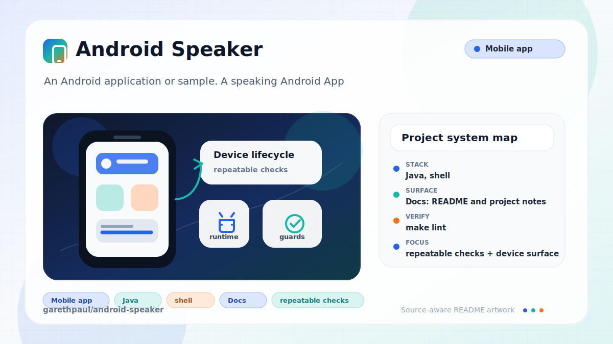

# android-speaker

<!-- README-OVERVIEW-IMAGE -->


## Overview

`garethpaul/android-speaker` is an Android application or sample. A speaking Android App

This legacy Android sample turns typed text into spoken audio using a remote
text-to-speech endpoint.

This README is based on the checked-in source, manifests, scripts, and repository metadata on the `master` branch. The project language mix found during review was: Java (2), shell (1).

## Repository Contents

- `README.md` - project overview and local usage notes
- `build.gradle` - Android or Gradle build configuration
- `app` - source or example code
- `docs` - source or example code
- `gradle` - source or example code
- `gradlew` - Android or Gradle build configuration
- `scripts` - source or example code
- `SECURITY.md` - security reporting and disclosure guidance
- `VISION.md` - project direction and maintenance guardrails

Additional scan context:

- Source directories: app, docs, gradle, scripts
- Dependency and build manifests: build.gradle, gradlew
- Entry points or build surfaces: Gradle build files
- Test-looking files: app/src/androidTest/java/garethpaul/com/androidspeaker/ApplicationTest.java

## Getting Started

### Prerequisites

- Git
- Android Studio or a compatible Android SDK
- Gradle or the checked-in Gradle wrapper when present

### Setup

```bash
git clone https://github.com/garethpaul/android-speaker.git
cd android-speaker
make check
scripts/check-baseline.sh
./gradlew lint --no-daemon
./gradlew test --no-daemon
./gradlew assembleDebug --no-daemon
```

The setup commands above are derived from repository files. Legacy mobile, Python, or JavaScript samples may require older SDKs or package versions than a modern workstation uses by default.

## Running or Using the Project

- Use Android Studio to open the project or run `./gradlew assembleDebug` when the Android SDK is configured.

## Testing and Verification

- `make lint` - runs the SDK-free baseline and Gradle lint when the Android SDK is configured.
- `make test` - runs Gradle tests when the Android SDK is configured.
- `make build` - runs debug assembly when the Android SDK is configured.
- `make check` - runs the aggregate lint, test, and build gates.
- `scripts/check-baseline.sh` - runs SDK-free source baseline checks.
- GitHub Actions runs `make check` through `.github/workflows/check.yml` on
  pushes, pull requests, and manual dispatches.
- Local Gradle checks require an explicit `ANDROID_HOME`; CI clears ambient SDK
  variables to preserve the documented static-only boundary.
- The SDK-free baseline protects input normalization, URL encoding, async media
  preparation, playback failure handling, completion cleanup, and resource
  hygiene.
- `./gradlew lint --no-daemon`, `./gradlew test --no-daemon`, and `./gradlew assembleDebug --no-daemon` when the Android SDK is configured.

When the required SDK or runtime is unavailable, use static checks and source review first, then verify on a machine that has the matching platform toolchain.

## Configuration and Secrets

- No required secret or credential file was identified in the repository scan. If you add integrations later, keep secrets out of git.
- This legacy Android baseline pins Android build-tools 24.0.3 and Android Gradle Plugin 1.1.0.
- Speech input is trimmed, must be non-empty, and is capped at 200 characters
  before constructing the remote TTS URL.
- Startup checks that the required speech controls are available before wiring
  playback actions.

## Security and Privacy Notes

- Review changes touching network requests, sockets, or service endpoints; examples from the scan include app/src/androidTest/java/garethpaul/com/androidspeaker/ApplicationTest.java, app/src/main/AndroidManifest.xml, app/src/main/java/garethpaul/com/androidspeaker/MainActivity.java, app/src/main/res/layout/activity_main.xml, and 3 more.
- Review changes touching mobile permissions or privacy-sensitive device data; examples from the scan include app/src/main/AndroidManifest.xml, docs/plans/2026-06-08-speaker-lint-resource-baseline.md, docs/plans/2026-06-08-speaker-privacy-build-baseline.md, gradlew, and 1 more.
- Review changes touching file, media, JSON, XML, CSV, OCR, or data parsing; examples from the scan include app/lint.xml, app/src/main/AndroidManifest.xml, app/src/main/res/values/colors.xml, app/src/main/res/values-v21/styles.xml, and 3 more.
- Review changes touching database, model, or persistence code; examples from the scan include docs/plans/2026-06-08-speaker-privacy-build-baseline.md.
- Auto Backup disabled is part of the privacy baseline because the app has no
  documented restore behavior for user-entered speech text or generated
  playback state.

## Maintenance Notes

- This looks like a legacy Android project or sample. Expect Android SDK, Gradle, and support-library versions to matter.
- The current baseline URL-encodes text before calling the TTS endpoint, uses an
  HTTPS request URL, avoids logging user-entered text, and removes the unused
  external-storage download path.
- Remote media playback uses asynchronous media preparation so the UI thread
  does not block while the remote audio stream is prepared, and completed
  playback releases its active `MediaPlayer`.
- Active speech playback is released when the activity pauses so remote audio
  does not continue after the UI leaves the foreground.
- Stale MediaPlayer callbacks are ignored so older preparation, completion, or
  failure events cannot affect a newer playback request.
- It also uses HTTPS Maven Central for build resolution. `app/lint.xml`
  suppresses only the obsolete lint API database error from this old toolchain
  and the missing-density-folder warning for the bitmap asset intentionally kept
  in `drawable-nodpi`.
- Future work should replace the remote TTS call with platform `TextToSpeech`
  or a documented provider, add media playback tests, modernize SDK levels, and
  verify runtime behavior on an emulator or device.
- See `SECURITY.md` for vulnerability reporting and safe research guidance.
- See `VISION.md` for project direction and contribution guardrails.
- See `docs/plans/2026-06-09-speaker-playback-completion-cleanup.md` for the
  playback completion cleanup contract.
- See `docs/plans/2026-06-09-speaker-speech-length-bound.md` for the speech
  input length contract.
- See `docs/plans/2026-06-09-speaker-make-gate-targets.md` for the root lint,
  test, and build gate contract.
- See `docs/plans/2026-06-09-speaker-startup-control-guard.md` for the
  required control startup guard.
- See `docs/plans/2026-06-09-speaker-stale-player-callback-guard.md` for the
  stale MediaPlayer callback guard.
- See `docs/plans/2026-06-09-speaker-pause-release.md` for the pause-time
  playback release contract.
- See `docs/plans/2026-06-10-ci-baseline.md` for the GitHub Actions baseline.

## Contributing

Keep changes small and tied to the project that is already present in this repository. For code changes, document the toolchain used, avoid committing generated dependency directories or local configuration, and update this README when setup or verification steps change.
